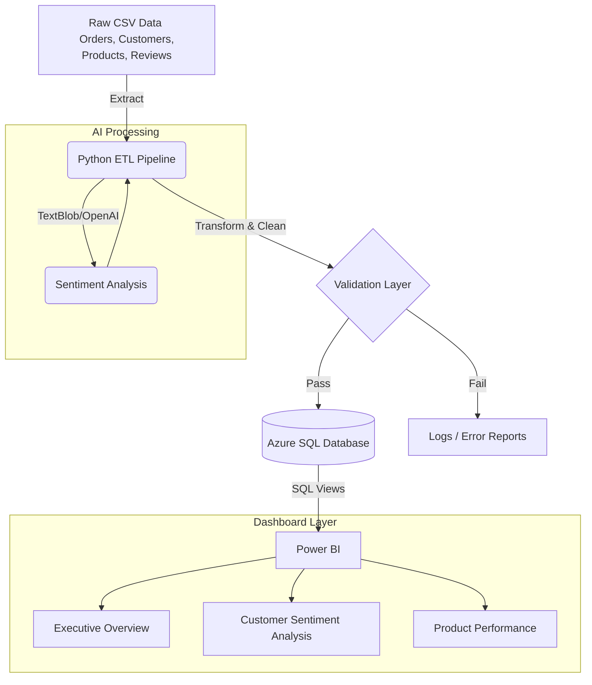
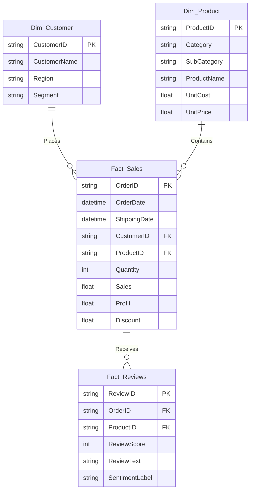

# System Architecture

## High-Level Data Flow

```mermaid
graph TD
    A[Raw CSV Data \n Orders, Customers, Products, Reviews] -->|Extract| B(Python ETL Pipeline)
    B -->|Transform & Clean| C{Validation Layer}
    C -->|Pass| D[(Azure SQL Database)]
    C -->|Fail| E[Logs / Error Reports]
    D -->|SQL Views| F[Power BI]
    
    subgraph AI Processing
    B -->|TextBlob/OpenAI| G(Sentiment Analysis)
    G --> B
    end
    
    subgraph Dashboard Layer
    F --> H[Executive Overview]
    F --> I[Customer Sentiment Analysis]
    F --> J[Product Performance]
    end
```

## Database Entity-Relationship (ER) Diagram (Star Schema)

```mermaid
erDiagram
    Dim_Customer ||--o{ Fact_Sales : "Places"
    Dim_Product ||--o{ Fact_Sales : "Contains"
    Fact_Sales ||--o{ Fact_Reviews : "Receives"
    
    Dim_Customer {
        string CustomerID PK
        string CustomerName
        string Region
        string Segment
    }
    
    Dim_Product {
        string ProductID PK
        string Category
        string SubCategory
        string ProductName
        float UnitCost
        float UnitPrice
    }
    
    Fact_Sales {
        string OrderID PK
        datetime OrderDate
        datetime ShippingDate
        string CustomerID FK
        string ProductID FK
        int Quantity
        float Sales
        float Profit
        float Discount
    }
    
    Fact_Reviews {
        string ReviewID PK
        string OrderID FK
        string ProductID FK
        int ReviewScore
        string ReviewText
        string SentimentLabel
    }
```
